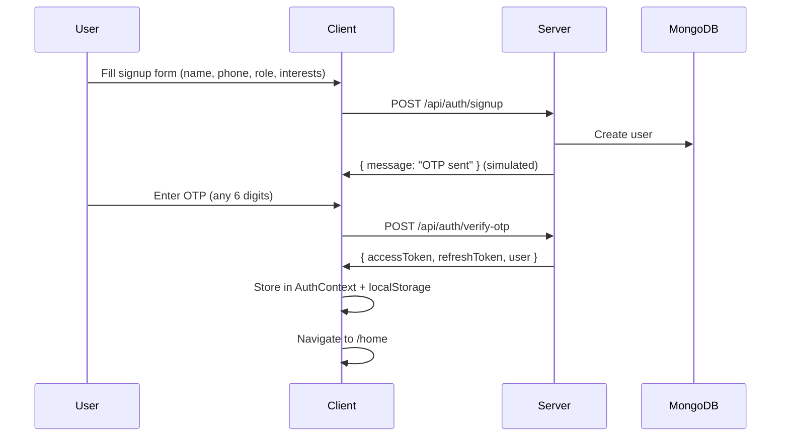

# Globist — Full-Stack Working Prototype

Build a working full-stack web app from the [Globist HTML prototype](file:///Users/akshalraina/Downloads/globist_prototype.html), replicating all 12 screens with real backend data, auth, and booking logic.

## Tech Stack

| Layer | Technology |
|-------|-----------|
| Frontend | React 18 + Vite + React Router v6 |
| Styling | Vanilla CSS (ported from prototype's design system) |
| Backend | Node.js + Express.js |
| Database | MongoDB + Mongoose |
| Auth | JWT (access + refresh tokens) |
| State | React Context API |

---

## User Review Required

> [!IMPORTANT]
> **MongoDB Connection**: The backend needs a MongoDB instance. I'll default to `mongodb://localhost:27017/globist` for local development. Do you have MongoDB installed locally, or should I use an in-memory MongoDB (via `mongodb-memory-server`) so it works without any setup?

> [!IMPORTANT]
> **No real payment gateway**: Booking payment will be simulated (mock). The UI will match the prototype (UPI/Card/Net Banking selection) but no actual payment processing.

> [!IMPORTANT]
> **No file upload for Reels**: The "Post Reel" screen will be fully functional UI, but video upload will be mocked (metadata stored in DB, no actual video storage).

---

## Project Structure

```
/Users/akshalraina/.gemini/antigravity-ide/scratch/globist/
├── server/                      # Express API
│   ├── package.json
│   ├── index.js                 # Entry point, DB connect, middleware
│   ├── config/
│   │   └── db.js                # MongoDB connection
│   ├── middleware/
│   │   ├── auth.js              # JWT verify middleware
│   │   └── errorHandler.js      # Global error handler
│   ├── models/
│   │   ├── User.js              # User schema (traveler/creator/agency)
│   │   ├── Agency.js            # Travel agency profiles
│   │   ├── Trip.js              # Trip packages with itineraries
│   │   ├── Region.js            # Geographic regions (Himachal, etc.)
│   │   ├── Booking.js           # Booking records
│   │   ├── Reel.js              # User-posted reels
│   │   └── Referral.js          # Referral tracking + points
│   ├── routes/
│   │   ├── auth.js              # POST /signup, /login, /verify-otp
│   │   ├── users.js             # GET /profile, PUT /profile
│   │   ├── agencies.js          # CRUD agencies + trips
│   │   ├── regions.js           # GET regions, GET region/:id
│   │   ├── bookings.js          # POST /book, GET /my-bookings
│   │   ├── reels.js             # CRUD reels, like/comment
│   │   └── explore.js           # Search, trending, featured
│   └── seed/
│       └── seed.js              # Seed DB with prototype data
│
├── client/                      # React + Vite
│   ├── package.json
│   ├── vite.config.js
│   ├── index.html
│   └── src/
│       ├── main.jsx
│       ├── App.jsx              # Router setup
│       ├── index.css            # Full design system from prototype
│       ├── context/
│       │   └── AuthContext.jsx  # Auth state + JWT management
│       ├── components/
│       │   ├── BottomNav.jsx    # Shared bottom navigation
│       │   ├── StatusBar.jsx    # iOS-style status bar
│       │   ├── SearchBar.jsx
│       │   ├── TripCard.jsx     # Reusable trip card
│       │   ├── AgencyCard.jsx   # Agency listing card
│       │   ├── ReelCard.jsx     # Reel thumbnail card
│       │   ├── Pill.jsx         # Tag/filter pill
│       │   ├── StarRating.jsx
│       │   ├── WalletCard.jsx   # Points/wallet display
│       │   └── ProtectedRoute.jsx
│       └── pages/
│           ├── Splash.jsx       # Screen 1 — Onboarding
│           ├── Signup.jsx       # Screen 2 — Registration
│           ├── Home.jsx         # Screen 3 — Home feed
│           ├── Reels.jsx        # Screen 4 — Reels viewer
│           ├── Explore.jsx      # Screen 5 — Discovery
│           ├── Region.jsx       # Screen 6 — Region detail
│           ├── TripDetail.jsx   # Screen 7 — Trip package
│           ├── Booking.jsx      # Screen 8 — Booking flow
│           ├── PostReel.jsx     # Screen 9 — Post a reel
│           ├── Profile.jsx      # Screen 10 — User profile
│           ├── MyTrips.jsx      # Screen 11 — My trips + wishlist
│           └── Menu.jsx         # Screen 12 — Settings menu
```

---

## Proposed Changes

### Database Models

#### [NEW] [User.js](file:///Users/akshalraina/.gemini/antigravity-ide/scratch/globist/server/models/User.js)

```js
{
  name: String,           // "Arjun Sharma"
  phone: String,          // "+91 98765 43210" (unique)
  role: enum['traveler', 'creator', 'agency'],
  interests: [String],    // ["Trekking", "Camping", "Snow"]
  bio: String,
  location: String,       // "New Delhi, India"
  avatar: String,         // URL or initials
  referralPoints: Number, // Default 0
  explorerTier: enum['bronze', 'silver', 'gold', 'elite'],
  stats: {
    trips: Number,
    followers: Number,
    bookingsInspired: Number,
    reviews: Number
  },
  isVerified: Boolean,
  password: String,       // hashed (for prototype, OTP is simulated)
  refreshToken: String,
  createdAt: Date
}
```

#### [NEW] [Agency.js](file:///Users/akshalraina/.gemini/antigravity-ide/scratch/globist/server/models/Agency.js)

```js
{
  name: String,            // "Himalayan High Treks"
  description: String,
  location: String,        // "Manali, Himachal Pradesh"
  region: ObjectId → Region,
  category: [String],      // ["Adventure", "Treks"]
  rating: Number,          // 4.9
  reviewCount: Number,
  isVerified: Boolean,
  startingPrice: Number,   // 12500
  imageType: String,       // "mountain", "valley", etc. (gradient placeholder)
  trips: [ObjectId → Trip]
}
```

#### [NEW] [Trip.js](file:///Users/akshalraina/.gemini/antigravity-ide/scratch/globist/server/models/Trip.js)

```js
{
  agency: ObjectId → Agency,
  name: String,            // "Spiti Valley Expedition"
  description: String,
  pricePerPerson: Number,
  duration: Number,        // days
  difficulty: enum['easy', 'moderate', 'hard'],
  groupSize: { min: Number, max: Number },
  nextSlot: Date,
  itinerary: [{
    day: Number,
    title: String,
    description: String
  }],
  imageType: String,
  activeUsers: Number,     // "34 active now"
  region: ObjectId → Region
}
```

#### [NEW] [Region.js](file:///Users/akshalraina/.gemini/antigravity-ide/scratch/globist/server/models/Region.js)

```js
{
  name: String,           // "Himachal Pradesh"
  spotCount: Number,      // 42
  verifiedAgencies: Number,
  imageType: String,
  subLocations: [String]  // ["Manali", "Kasol", "Shimla", "Spiti"]
}
```

#### [NEW] [Booking.js](file:///Users/akshalraina/.gemini/antigravity-ide/scratch/globist/server/models/Booking.js)

```js
{
  user: ObjectId → User,
  trip: ObjectId → Trip,
  agency: ObjectId → Agency,
  checkIn: Date,
  checkOut: Date,
  adults: Number,
  children: Number,
  totalAmount: Number,
  discount: Number,
  platformFee: Number,
  paymentMethod: enum['upi', 'card', 'netbanking'],
  referralPointsUsed: Number,
  status: enum['pending', 'confirmed', 'completed', 'cancelled'],
  referredBy: ObjectId → User,  // Creator who inspired this booking
  createdAt: Date
}
```

#### [NEW] [Reel.js](file:///Users/akshalraina/.gemini/antigravity-ide/scratch/globist/server/models/Reel.js)

```js
{
  user: ObjectId → User,
  agency: ObjectId → Agency,
  booking: ObjectId → Booking,
  caption: String,
  tags: [String],          // ["#Himachal", "#Manali"]
  location: String,
  isAffiliate: Boolean,    // earns referral points
  likes: Number,
  comments: Number,
  shares: Number,
  imageType: String,       // gradient background type
  createdAt: Date
}
```

#### [NEW] [Referral.js](file:///Users/akshalraina/.gemini/antigravity-ide/scratch/globist/server/models/Referral.js)

```js
{
  creator: ObjectId → User,    // who earned the points
  booking: ObjectId → Booking, // the booking that triggered it
  reel: ObjectId → Reel,       // the affiliate reel
  pointsEarned: Number,
  percentage: Number,          // 3%
  createdAt: Date
}
```

---

### Backend API Routes

#### [NEW] [auth.js](file:///Users/akshalraina/.gemini/antigravity-ide/scratch/globist/server/routes/auth.js)

| Method | Endpoint | Description |
|--------|----------|-------------|
| POST | `/api/auth/signup` | Register with name, phone, role, interests |
| POST | `/api/auth/login` | Login with phone + password |
| POST | `/api/auth/verify-otp` | Simulate OTP verification, return JWT |
| POST | `/api/auth/refresh` | Refresh access token |
| POST | `/api/auth/logout` | Invalidate refresh token |

#### [NEW] [users.js](file:///Users/akshalraina/.gemini/antigravity-ide/scratch/globist/server/routes/users.js)

| Method | Endpoint | Description |
|--------|----------|-------------|
| GET | `/api/users/profile` | Get authenticated user profile |
| PUT | `/api/users/profile` | Update profile (bio, location, interests) |
| GET | `/api/users/wallet` | Get referral points + tier info |
| POST | `/api/users/wishlist/:tripId` | Add/remove trip from wishlist |
| GET | `/api/users/wishlist` | Get user's wishlist |

#### [NEW] [agencies.js](file:///Users/akshalraina/.gemini/antigravity-ide/scratch/globist/server/routes/agencies.js)

| Method | Endpoint | Description |
|--------|----------|-------------|
| GET | `/api/agencies` | List all agencies (with filters) |
| GET | `/api/agencies/:id` | Get agency detail with trips |
| GET | `/api/agencies/featured` | Get featured/top-rated agencies |

#### [NEW] [regions.js](file:///Users/akshalraina/.gemini/antigravity-ide/scratch/globist/server/routes/regions.js)

| Method | Endpoint | Description |
|--------|----------|-------------|
| GET | `/api/regions` | List all regions |
| GET | `/api/regions/:id` | Region detail with agencies |
| GET | `/api/regions/featured` | Featured regions for home |

#### [NEW] [bookings.js](file:///Users/akshalraina/.gemini/antigravity-ide/scratch/globist/server/routes/bookings.js)

| Method | Endpoint | Description |
|--------|----------|-------------|
| POST | `/api/bookings` | Create booking (dates, travelers, payment) |
| GET | `/api/bookings` | Get user's bookings |
| GET | `/api/bookings/:id` | Booking detail |
| PATCH | `/api/bookings/:id/cancel` | Cancel a booking |

#### [NEW] [reels.js](file:///Users/akshalraina/.gemini/antigravity-ide/scratch/globist/server/routes/reels.js)

| Method | Endpoint | Description |
|--------|----------|-------------|
| GET | `/api/reels` | Get reels feed (paginated) |
| GET | `/api/reels/trending` | Get trending reels for home |
| POST | `/api/reels` | Post a new reel |
| POST | `/api/reels/:id/like` | Like/unlike a reel |
| GET | `/api/reels/agency/:agencyId` | Reels for a specific agency |

#### [NEW] [explore.js](file:///Users/akshalraina/.gemini/antigravity-ide/scratch/globist/server/routes/explore.js)

| Method | Endpoint | Description |
|--------|----------|-------------|
| GET | `/api/explore/search` | Search agencies, regions, trips |
| GET | `/api/explore/trending-topics` | Trending topics for home |
| GET | `/api/explore/home-feed` | Aggregated home feed data |

---

### Frontend Pages (12 Screens)

#### [NEW] [Splash.jsx](file:///Users/akshalraina/.gemini/antigravity-ide/scratch/globist/client/src/pages/Splash.jsx)
Route: `/` — Onboarding with Globist branding, mountain visuals, "Get Started" and "I already have an account" CTAs.

#### [NEW] [Signup.jsx](file:///Users/akshalraina/.gemini/antigravity-ide/scratch/globist/client/src/pages/Signup.jsx)
Route: `/signup` — Role selection (Traveler/Creator/Agency), name, phone, interests, OTP flow. Calls `POST /api/auth/signup` → stores JWT in context.

#### [NEW] [Home.jsx](file:///Users/akshalraina/.gemini/antigravity-ide/scratch/globist/client/src/pages/Home.jsx)
Route: `/home` — Featured regions, trending reels carousel, trending topics, popular agencies. Fetches from `/api/explore/home-feed`.

#### [NEW] [Reels.jsx](file:///Users/akshalraina/.gemini/antigravity-ide/scratch/globist/client/src/pages/Reels.jsx)
Route: `/reels` — Full-screen reel view with side actions (like, comment, share, save), creator info, book-now strip. Fetches from `/api/reels`.

#### [NEW] [Explore.jsx](file:///Users/akshalraina/.gemini/antigravity-ide/scratch/globist/client/src/pages/Explore.jsx)
Route: `/explore` — Search bar, category pills, luxury stays banner, region grid (2×2), top rated agencies. Fetches from `/api/explore/search`, `/api/regions`, `/api/agencies`.

#### [NEW] [Region.jsx](file:///Users/akshalraina/.gemini/antigravity-ide/scratch/globist/client/src/pages/Region.jsx)
Route: `/region/:id` — Region hero, filter pills, sort options, agency cards with verified badges. Fetches from `/api/regions/:id`.

#### [NEW] [TripDetail.jsx](file:///Users/akshalraina/.gemini/antigravity-ide/scratch/globist/client/src/pages/TripDetail.jsx)
Route: `/trip/:id` — Trip hero, price info, info grid (duration/group/difficulty/next slot), creator referral strip, itinerary, traveler reels. Fetches from `/api/agencies/:id` + trip data.

#### [NEW] [Booking.jsx](file:///Users/akshalraina/.gemini/antigravity-ide/scratch/globist/client/src/pages/Booking.jsx)
Route: `/booking/:tripId` — Multi-step booking: progress bar, calendar date picker, traveler counter, price summary, payment method selection, referral points. Calls `POST /api/bookings`.

#### [NEW] [PostReel.jsx](file:///Users/akshalraina/.gemini/antigravity-ide/scratch/globist/client/src/pages/PostReel.jsx)
Route: `/post-reel` — Upload area, caption, agency tagging, affiliate toggle, earnings preview, location/tags. Calls `POST /api/reels`.

#### [NEW] [Profile.jsx](file:///Users/akshalraina/.gemini/antigravity-ide/scratch/globist/client/src/pages/Profile.jsx)
Route: `/profile` — Avatar, stats row, wallet card with points/tier/progress, tabs (Bookings/Reels/Saved/Reviews), upcoming journeys. Fetches from `/api/users/profile`.

#### [NEW] [MyTrips.jsx](file:///Users/akshalraina/.gemini/antigravity-ide/scratch/globist/client/src/pages/MyTrips.jsx)
Route: `/my-trips` — Active trip cards with confirmed status, wishlist items, "Where to next?" CTA. Fetches from `/api/bookings` + `/api/users/wishlist`.

#### [NEW] [Menu.jsx](file:///Users/akshalraina/.gemini/antigravity-ide/scratch/globist/client/src/pages/Menu.jsx)
Route: `/menu` — User info, menu items (Profile, Communities, Bookings, Notifications, Wallet), Support & Settings, logout.

---

### Frontend Components

| Component | Purpose |
|-----------|---------|
| `BottomNav` | 4-tab navigation (Home, Reels, Explore, Trips) with active state |
| `StatusBar` | iOS-style status bar (time, signal, battery) |
| `SearchBar` | Search input with icon |
| `TripCard` | Reusable card for trip listings |
| `AgencyCard` | Full agency card with image, rating, price, tags |
| `ReelCard` | Reel thumbnail for horizontal scroll |
| `Pill` | Filter/tag pill with active state |
| `StarRating` | Star + value + count display |
| `WalletCard` | Dark card with points, tier, progress bar |
| `ProtectedRoute` | Auth guard wrapper for protected pages |

---

### Seed Data

#### [NEW] [seed.js](file:///Users/akshalraina/.gemini/antigravity-ide/scratch/globist/server/seed/seed.js)

Pre-populates the database with all data from the prototype:
- **4 Regions**: Himachal Pradesh, Uttarakhand, Rajasthan, Kerala
- **6 Agencies**: Himalayan High Treks, Ganges Valley Treks, Auli Snow Escapes, Manali Luxury Escapes, Shimla Heritage Walks, etc.
- **6+ Trips**: With full itineraries matching the prototype
- **5+ Reels**: With likes/comments/shares data
- **1 Demo User**: Arjun Sharma (Gold Explorer, 2450 points)
- **2 Bookings**: Manali Snow Expedition (confirmed), Rishikesh Rafting (upcoming)
- **Trending Topics**: Local Hidden Gems, Historic Expeditions, Luxury Stays, Treks

---

## Auth Flow



---

## Referral Points System

| Tier | Bookings Inspired | Badge |
|------|-------------------|-------|
| Bronze | 0–9 | 🥉 |
| Silver | 10–24 | 🥈 |
| Gold | 25–49 | 🥇 |
| Elite | 50+ | 💎 |

- Creators earn **3% of trip price** as referral points per booking
- 1 point = ₹1 discount on bookings
- Only 1 affiliate reel per booking

---

## Verification Plan

### Automated Tests
```bash
# Seed the database
cd server && node seed/seed.js

# Start backend
cd server && npm run dev    # runs on port 5000

# Start frontend
cd client && npm run dev    # runs on port 5173
```

### Manual Verification
1. Open `http://localhost:5173` → Splash screen loads
2. Click "Get Started" → Signup screen with role selection
3. Fill form → OTP screen → redirects to Home with real data
4. Navigate all 12 screens via bottom nav and links
5. Create a booking → verify it appears in My Trips
6. Post a reel → verify it appears in Reels feed
7. Check Profile → verify wallet points and stats
